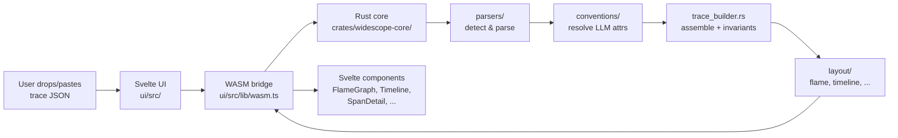

# Contributing to WideScope

Thanks for your interest in contributing! WideScope is a browser-native trace viewer for LLM and AI agent pipelines, built with Rust/WASM and Svelte 5. This guide explains how the pieces fit together and how to extend the most common surfaces (parsers, views, conventions).

For deep implementation details — data models, wire contracts, edge-case rules, and rendering algorithms — see [`docs/LLD.md`](docs/LLD.md). This file points at the right places to plug in new code; the LLD is the reference.

---

## Table of Contents

1. [Getting Started](#1-getting-started)
2. [Architecture Overview](#2-architecture-overview)
3. [Repository Layout](#3-repository-layout)
4. [Adding a New Parser](#4-adding-a-new-parser)
5. [Adding a New View](#5-adding-a-new-view)
6. [Adding a Convention Mapping File](#6-adding-a-convention-mapping-file)
7. [Extending an Existing Convention](#7-extending-an-existing-convention)
8. [Rebuilding the Share Dictionary](#8-rebuilding-the-share-dictionary)
9. [Publishing (Cloudflare Pages + Custom Domain)](#9-publishing-cloudflare-pages--custom-domain)
10. [Code Style](#10-code-style)
11. [Test Coverage](#11-test-coverage)
12. [PR Checklist](#12-pr-checklist)

---

## 1. Getting Started

Install prerequisites listed in the [README](README.md#requirements) (Rust via rustup, the `wasm32-unknown-unknown` target, `wasm-pack`, Node.js 18+, `just`, and optionally `binaryen` for `wasm-opt`).

```bash
# One-time
just ui-install

# Build everything
just build

# Run the dev server (UI only — re-run `just build-wasm` after Rust changes)
just dev
# → http://localhost:5173
```

Before opening a PR, run:

```bash
just fmt          # cargo fmt --all
just check        # cargo check --workspace
just clippy       # cargo clippy --workspace -- -D warnings
just test         # cargo test --workspace
```

---

## 2. Architecture Overview

WideScope is split into a **Rust core** that compiles to WebAssembly and a **Svelte 5 UI** that drives it. All parsing, layout, and analytics happen in WASM; the UI is a thin shell that calls into it and renders the results.



**Key design points:**

- **All data crosses the WASM↔JS boundary as JSON strings** (see [LLD §6](docs/LLD.md)). This keeps the contract debuggable and avoids `wasm-bindgen` type-marshalling complexity.
- **No runtime fetch.** Conventions and the sample trace are bundled into the JS at build time using Vite `?raw` imports, so `connect-src: 'none'` stays enforceable.
- **WASM holds one trace at a time.** `parse_trace` replaces any prior trace. See [LLD §6.3](docs/LLD.md) for lifecycle semantics.
- **Raw values are normative; `*_display` strings are convenience.** Durations, token counts, costs cross the boundary as raw numbers — the UI may use or ignore the pre-formatted strings.

---

## 3. Repository Layout

```
widescope/
├── crates/widescope-core/      # Rust WASM library
│   └── src/
│       ├── lib.rs              # #[wasm_bindgen] exports
│       ├── parsers/            # Add a new format here
│       │   ├── mod.rs          # Format detection + dispatch
│       │   ├── otlp_json.rs
│       │   ├── jaeger.rs
│       │   └── openinference.rs
│       ├── conventions/        # Mapping registry + resolver
│       ├── layout/             # Add a new visual layout here
│       ├── models/             # Span, Trace, Llm, layout types
│       ├── trace_builder.rs    # Assembly, warnings, self-time, cycles
│       ├── share.rs            # DEFLATE share-link compression
│       └── errors.rs
├── ui/                         # Svelte 5 + Vite app
│   └── src/
│       ├── App.svelte
│       ├── components/         # Add a new view component here
│       ├── lib/                # wasm bridge, input handling, types
│       └── stores/             # Svelte stores
├── conventions/                # LLM attribute mapping files (JSON)
├── test-fixtures/              # Sample traces by format
└── docs/LLD.md                 # Authoritative design reference
```

---

## 4. Adding a New Parser

A parser converts a vendor-specific trace JSON into the canonical `Vec<Span>` model. The canonical types are defined in `crates/widescope-core/src/models/`; the parser's job is field mapping plus best-effort recovery from malformed input.

**Read first:** [LLD §4](docs/LLD.md) — covers trace invariants (duplicate IDs, timestamp inversion, cycles, orphan parents) that every parser must honor.

### Step-by-step

1. **Create the parser file.** `crates/widescope-core/src/parsers/myformat.rs`:

   ```rust
   use crate::errors::WideError;
   use crate::models::span::Span;
   use crate::models::trace::ParseWarning;
   use serde_json::Value;

   pub struct MyFormatParseResult {
       pub spans: Vec<Span>,
       pub warnings: Vec<ParseWarning>,
   }

   pub fn parse_myformat_with_warnings(root: &Value) -> Result<MyFormatParseResult, WideError> {
       let mut spans = Vec::new();
       let mut warnings = Vec::new();

       // 1. Walk the input structure.
       // 2. Map each vendor field to the canonical Span fields
       //    (see docs/LLD.md §4.3 for the OTLP table as a worked example).
       // 3. On missing-but-required fields: skip the span and push a warning,
       //    do NOT fail the whole parse.
       // 4. Honor invariants from LLD §4.6 — but most of these (cycles,
       //    duplicates, swapped timestamps) are enforced centrally in
       //    trace_builder.rs; your parser just needs to emit raw spans.

       Ok(MyFormatParseResult { spans, warnings })
   }
   ```

   Follow the existing pattern in `otlp_json.rs`, `jaeger.rs`, or `openinference.rs` — each defines its own `*ParseResult` struct.

2. **Register the format.** In `crates/widescope-core/src/models/trace.rs`, add a variant to `InputFormat` (e.g. `MyFormat`).

3. **Wire detection.** In `crates/widescope-core/src/parsers/mod.rs`, add a heuristic to `detect_format` that recognizes your top-level JSON shape, and a dispatch arm in `parse`:

   ```rust
   InputFormat::MyFormat => {
       myformat::parse_myformat_with_warnings(&value)?.spans
   }
   ```

   `pub mod myformat;` at the top of the file.

4. **Test fixtures.** Add at least one minimal trace under `test-fixtures/myformat/sample.json` and reference it from a `#[cfg(test)]` module in your parser file.

5. **(Optional) Update the bundled sample.** If your format is common enough to warrant first-class onboarding, you can update `ui/src/lib/sample.ts` — but the default sample is OTLP and there is rarely a reason to change it.

6. **Convention mapping.** If your format uses a different attribute vocabulary for LLM data (e.g. `myframework.model_name` instead of `gen_ai.request.model`), add a convention file — see [§6](#6-adding-a-convention-mapping-file).

7. **Document support.** Add a row to the **Supported Formats** table in the README.

---

## 5. Adding a New View

Views render layout data produced by the Rust core. Existing views: `FlameGraph` (canvas), `Timeline` (SVG), `Waterfall`, `ServiceGraph`, and `DiffView`.

### Step-by-step

1. **Define the layout struct** in `crates/widescope-core/src/models/layout.rs`. Follow the existing pattern: raw values (durations in ns, normalized coords in `[0,1]`) plus optional `_display` convenience strings. See [LLD §3.4](docs/LLD.md).

2. **Implement the layout algorithm** under `crates/widescope-core/src/layout/myview.rs`. Add `pub mod myview;` to `crates/widescope-core/src/layout/mod.rs`.

3. **Export from WASM.** In `crates/widescope-core/src/lib.rs`, add:

   ```rust
   #[wasm_bindgen]
   pub fn compute_myview() -> Result<String, JsValue> {
       // Read the cached Trace from the thread-local, compute the layout,
       // and return serde_json::to_string(&layout).
   }
   ```

4. **Mirror the type in TypeScript.** Add the interface to `ui/src/lib/types.ts` so it stays in lockstep with the Rust struct. The Rust struct's serialized shape **is** the contract.

5. **Add a JS wrapper.** In `ui/src/lib/wasm.ts`:

   ```ts
   export function getMyViewLayout(): MyViewLayout {
     return JSON.parse(compute_myview());
   }
   ```

6. **Add the component.** Create `ui/src/components/MyView.svelte`. Read selection from `stores/selection.ts` and dispatch clicks back into `selectedSpanId`. Look at `FlameGraph.svelte` for the canvas pattern, `Timeline.svelte` for the SVG pattern.

7. **Wire the toolbar.** Add the view to `activeView` in `stores/selection.ts` and to the view toggle in `Toolbar.svelte`. Share links accept `view=<name>` — extend the parser in `ui/src/lib/` that handles that param if you want the new view to be deep-linkable.

---

## 6. Adding a Convention Mapping File

Convention files translate vendor-specific span attributes into the canonical `LlmSpanAttributes` model. They live in `conventions/` and are bundled into the JS at build time.

### Step-by-step

1. **Create the file** at `conventions/myframework.json`:

   ```json
   {
     "name": "MyFramework conventions",
     "version": "0.1.0",
     "detect": {
       "attribute_prefix": "myframework.",
       "any_key_present": ["myframework.model_name"]
     },
     "mappings": {
       "model_name":    { "attribute": "myframework.model_name" },
       "input_tokens":  { "attribute": "myframework.tokens.in",  "type": "int" },
       "output_tokens": { "attribute": "myframework.tokens.out", "type": "int" },
       "operation_type": {
         "attribute": "myframework.kind",
         "values": { "chat": "ChatCompletion", "embed": "Embedding" },
         "default": "Unknown"
       }
     }
   }
   ```

   See [`conventions/README.md`](conventions/README.md) for the full schema and [LLD §5](docs/LLD.md) for the resolver algorithm.

2. **Bundle it.** Add a `?raw` import to `ui/src/lib/conventions-bundle.ts` and append the new constant to `BUNDLED_CONVENTIONS`:

   ```ts
   import myframeworkRaw from '../../../conventions/myframework.json?raw';

   export const BUNDLED_CONVENTIONS: string[] = [
     otelRaw, openinferenceRaw, langchainRaw, myframeworkRaw,
   ];
   ```

3. **Set priority.** Conventions are first-match-wins in registration order. Place your new file in the order that makes sense for its `detect` rules — generally narrower/more-specific frameworks before broader ones.

4. **Add a fixture.** Drop a minimal trace under `test-fixtures/<your-format>/` (or extend an existing fixture) that exercises the new mappings.

5. **Update `conventions/README.md`** with a one-line entry naming your file.

---

## 7. Extending an Existing Convention

If a framework has added new attributes (e.g. a new `gen_ai.*` field in the OTel GenAI semconv), you usually don't need a new file — just extend the existing one.

1. Edit `conventions/opentelemetry.json` (or whichever file applies).
2. Bump the `version` field if you're tracking upstream releases.
3. Add a fixture that exercises the new attribute.
4. Run `just test` — the convention is bundled at build time, but you'll want to rebuild WASM (`just build-wasm`) and reload the dev server to see it in the UI.

---

## 8. Rebuilding the Share Dictionary

Share links DEFLATE-compress the trace JSON, seeded with a dictionary built from representative fixtures and embedded in the WASM binary. This makes small traces compress especially well so they fit in a URL `#fragment`.

When you add or significantly change a fixture and want it represented in the dictionary:

```bash
just train-share-dict
```

This rebuilds `crates/widescope-core/share-dict.bin` from the fixtures listed in the `train-share-dict` recipe.

**Important:** the dictionary contents are part of the share-link wire format. **Bump the format tag in `crates/widescope-core/src/share.rs` whenever the dictionary changes**, so older links produced with the previous dictionary still decode. Then run `just build-wasm` to embed the new dictionary.

The dictionary must stay at or below DEFLATE's 32 KiB sliding window — bytes beyond that are never referenced. `train-share-dict` prints the size so you can check.

---

## 9. Publishing (Cloudflare Pages + Custom Domain)

The repo is wired to deploy `ui/dist/` to Cloudflare Pages via GitHub Actions on every push to `main`.

### One-time setup

1. Create a Cloudflare Pages project named `widescope`.
2. In the GitHub repo, add secrets:
   - `CLOUDFLARE_API_TOKEN` — an API token scoped to "Cloudflare Pages: Edit"
   - `CLOUDFLARE_ACCOUNT_ID`
3. Push to `main`. The workflow in `.github/workflows/ci.yml` builds and deploys.
4. (Optional) In the Cloudflare Pages dashboard → **Custom Domains**, add your domain and point your DNS at Cloudflare.

### Publishing a fork to a different domain

If you're forking and want to deploy to your own domain:

1. Replace the project name in `wrangler.jsonc` if you want it to differ from `widescope`.
2. Update the `homepage` and badge URLs in `README.md`.
3. Set your fork's secrets as above; pushes to your fork's `main` will then deploy to your own Pages project.

---

## 10. Code Style

### Rust

- Follow `rustfmt` defaults. Run `just fmt` before pushing.
- `cargo clippy --workspace -- -D warnings` must pass. Address lints rather than suppressing them; if a suppression is genuinely necessary, add a comment explaining why.
- Prefer the canonical model types (`Span`, `LlmSpanAttributes`, etc.) over reaching into raw JSON in code outside `parsers/` and `conventions/`.
- Keep parsers permissive on input and strict on output: skip malformed records with a warning instead of failing the whole parse.

### TypeScript / Svelte

- TypeScript with `strict: true` (see `ui/tsconfig.json`).
- Match the Rust struct shape exactly when defining the TS mirror in `ui/src/lib/types.ts`. Drift here is the most common source of runtime bugs.
- Keep components small and read state from stores rather than threading props through deep trees.
- Don't `fetch()` at runtime. Anything that needs to be available offline must be bundled via Vite `?raw` imports.

### Commits and PRs

- Branch naming: `fix/<short-desc>`, `feat/<short-desc>`, `docs/<short-desc>`.
- One PR per logical change. Split refactors out from feature work where reasonable.
- Reference the issue number in the PR body (`Fixes #123`).

---

## 11. Test Coverage

Both suites are gated in CI, and the gates only ever move up.

```bash
just coverage        # Rust, per-file summary
just coverage-html   # Rust, browsable report
just coverage-ui     # UI (vitest + v8), fails under the configured thresholds
```

- **Rust**: 100% of lines, enforced by `cargo llvm-cov --fail-under-lines` in CI.
  The single exception is `to_js` in `lib.rs` — the `WideError -> JsValue`
  bridge traps on a non-wasm target, so `cargo test` can never execute it. Every
  exported function's logic lives in a `*_inner` function that tests drive
  directly; keep that split when you add one.
- **UI**: thresholds live in the vitest config. Components are tested through
  `@testing-library/svelte` — assert what a user sees, not internal state. What
  is excluded (canvas paint loops, animation frames, the entry bootstrap) is
  listed in the config with a reason on each line.

If a change genuinely cannot be covered, say why in the PR rather than lowering
a threshold.

## 12. PR Checklist

Before opening a PR, please confirm:

- [ ] `just fmt` — formatted
- [ ] `just check` — compiles clean
- [ ] `just clippy` — no warnings
- [ ] `just test` — tests pass
- [ ] `just coverage-gate` and `just coverage-ui` — coverage gates hold
- [ ] `just build` — UI bundle builds
- [ ] Added or updated a test fixture if you changed parser, layout, or convention behavior
- [ ] Updated the README **Supported Formats** table if you added a parser
- [ ] Updated `conventions/README.md` if you added a convention file
- [ ] Bumped the share-link format tag in `share.rs` if you regenerated the share dictionary
- [ ] Linked the issue in the PR description

Questions? [Open an issue](https://github.com/soumendrak/widescope/issues) — we're happy to help you find the right place to plug in.
