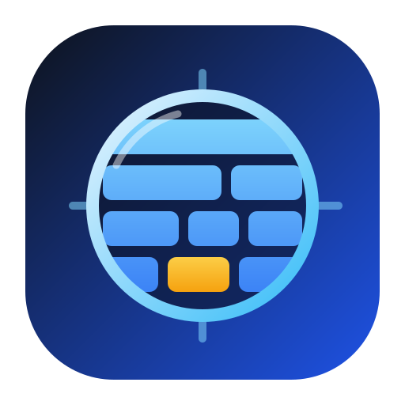
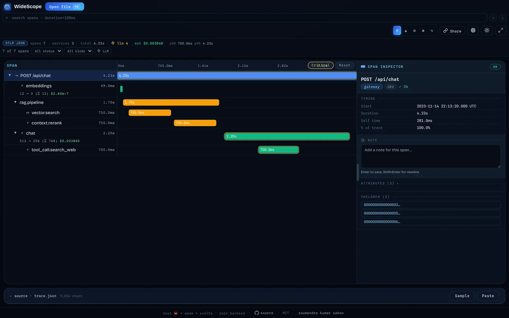

<p align="center">
  
</p>

<h1 align="center">WideScope</h1>

<p align="center">
  <strong>Browser-native trace viewer for LLM and AI agent pipelines</strong>
</p>

<p align="center">
  
  
  
  
  
</p>

<p align="center">
  <code>OTLP JSON</code>
  <code>Jaeger JSON</code>
  <code>Flame graph</code>
  <code>Timeline</code>
  <code>LLM-aware</code>
  <code>Local-first</code>
</p>

<p align="center">
  
</p>

A browser-based, zero-backend trace viewer for OpenTelemetry- and Jaeger-style traces, with an LLM-aware inspection UI powered by Rust/WASM and Svelte. Load a JSON trace locally, inspect it instantly, and keep the data entirely in your browser.

**No backend. No upload. No telemetry. Just your traces — in your browser.**

[Try the live demo →](https://widescope.soumendrak.com)

---

## Quick Demo

1. Open [widescope.soumendrak.com](https://widescope.soumendrak.com)
2. Click **Load sample JSON** in the editor toolbar
3. Explore the flame graph, timeline, and span details
4. Or drag in your own OTLP / Jaeger / OpenInference trace JSON

Sample trace files are available in [`test-fixtures/`](test-fixtures/) if you want to test locally.

---

## Features

- **Zero backend** — static UI + WASM, deployable to Cloudflare Pages, any CDN, or any static host.
- **Privacy-first** — local parsing and rendering in the browser; no upload flow and no runtime fetches for bundled conventions.
- **Supported inputs today** — OTLP JSON (`resourceSpans`) and Jaeger JSON (`data[].spans`).
- **LLM-aware inspection** — resolves OTel GenAI, OpenInference, and LangChain-style attributes into model, token, prompt/completion, and tool-call detail views.
- **Two trace views** — canvas flame graph plus a service-lane timeline view.
- **Fast navigation** — span search, keyboard traversal, zoom, pan, fit/reset controls, and search-result highlighting.
- **Flexible loading** — drag and drop, file picker, clipboard paste, or the built-in JSON editor with live parsing.
- **Detailed sidebar** — timing, status, attributes, events, child spans, and LLM metadata for the selected span.
- **Shareable links** — encode a whole trace into a self-contained link, or point at a hosted trace JSON — no upload, no backend.

## Sharing traces

WideScope can produce a link that reopens the exact trace, view, and selected span you are looking at.

- **Self-contained link** — click **🔗 Share** in the toolbar. The trace is DEFLATE-compressed — seeded with a dictionary built from representative traces and embedded in the WASM binary, so small traces compress especially well — and packed into the URL `#fragment`, which browsers never send to a server, so the data stays private. Best for small and medium traces; large traces are flagged with a one-click **Download trace** fallback. To rebuild the dictionary after adding fixtures, run `just train-share-dict` (see the recipe's notes on the format-tag bump).
- **Hosted trace** — open `https://widescope.soumendrak.com/?trace=<url>` to fetch a trace JSON from any HTTPS URL (CI artifact, gist, object storage).
- **Deep links** — both forms accept `view=<flame|timeline|waterfall|graph|diff>` and `span=<id>` to restore the view mode and pre-select a span.

## Requirements

| Tool | Version | Install |
|---|---|---|
| Rust (via rustup) | stable | `curl --proto '=https' --tlsv1.2 -sSf https://sh.rustup.rs \| sh` |
| wasm32 target | — | `rustup target add wasm32-unknown-unknown` |
| wasm-pack | 0.14+ | `cargo install wasm-pack` |
| Node.js | 18+ | <https://nodejs.org> |
| just | 1.0+ | `brew install just` / `cargo install just` |
| binaryen (`wasm-opt`) | optional, recommended | `brew install binaryen` / `apt install binaryen` |

> **Homebrew Rust users:** the `wasm32-unknown-unknown` target is not included in the Homebrew Rust package. Install Rust via `rustup` instead (both can coexist; prefix commands with `PATH="$HOME/.cargo/bin:$PATH"`).

## Quick Start

```bash
# 1. Install UI deps (one-time)
just ui-install

# 2. Build the WASM package and the production UI bundle
just build

# 3. Start the Vite dev server
just dev
# → http://localhost:5173
```

## Common Targets

```bash
just ui-install    # install ui/package.json dependencies
just build-wasm    # compile Rust -> WASM and optimize with wasm-opt when available
just build-ui      # vite production build -> ui/dist/
just build         # build-wasm + build-ui
just check         # cargo check --workspace
just fmt           # cargo fmt --all
just clippy        # cargo clippy --workspace -- -D warnings
just test          # cargo test --workspace
just clean         # remove Rust, WASM package, UI dist, and node_modules artifacts
```

## Development Notes

- **`just dev` only starts the UI dev server** — if you change Rust code, rerun `just build-wasm` to regenerate `crates/widescope-core/pkg/`.
- **`just build` produces the deployable static assets** in `ui/dist/`.
- **`wasm-opt` is optional** — the build still succeeds without it, but the generated `.wasm` will be larger.

## Deployment on Cloudflare Pages

This repo is set up to publish the static `ui/dist/` bundle to **Cloudflare Pages** from GitHub Actions.

1. Create a Cloudflare Pages project named `widescope`.
2. Add the GitHub repository secrets `CLOUDFLARE_API_TOKEN` and `CLOUDFLARE_ACCOUNT_ID`.
3. Push to `main` to trigger the deploy workflow.
4. Set a custom domain in Cloudflare Pages if you want the repo website field to use your own domain.

Recommended repo website value after setup:

```text
https://widescope.pages.dev
```

## Usage

1. Open `http://localhost:5173` in development, or deploy `ui/dist/` to Cloudflare Pages or any static host.
2. Load trace JSON by pasting into the editor, clicking **Open file**, dragging in a `.json` file, or using **Load sample JSON**.
3. Use **Format**, **Paste JSON**, **Submit JSON**, and **Clear JSON** in the editor toolbar as needed.
4. Switch between **Flame** and **Timeline** from the top toolbar.
5. Search spans from the toolbar to highlight matches and jump between them.
6. Click any span to inspect details in the resizable right sidebar.
7. In the flame graph, use **Cmd/Ctrl + scroll** to zoom, drag to pan, double-click to zoom to a span, and use `↑↓←→`, `Enter`, `Esc`, `F`, and `0` for keyboard navigation.

## Project Structure

```
widescope/
├── justfile                         # build automation
├── Cargo.toml                       # workspace root
├── rust-toolchain.toml              # stable toolchain + wasm target
├── crates/
│   └── widescope-core/              # Rust WASM library
│       ├── src/
│       │   ├── lib.rs               # wasm-bindgen exports and trace lifecycle
│       │   ├── models/              # span, trace, llm, and layout types
│       │   ├── parsers/             # OTLP JSON and Jaeger JSON parsers
│       │   ├── conventions/         # convention registry + attribute resolver
│       │   ├── layout/              # flamegraph and timeline layout algorithms
│       │   ├── trace_builder.rs     # trace assembly, warnings, self-time, cycles
│       │   └── errors.rs            # structured errors returned to JS
│       └── pkg/                     # generated by wasm-pack
├── ui/                              # Svelte 5 + Vite app shell
│   ├── src/
│   │   ├── App.svelte               # root shell and trace editor workspace
│   │   ├── components/              # toolbar, graphs, sidebar, drop zone, banners
│   │   ├── lib/                     # wasm loader, input handling, bundles, TS types
│   │   └── stores/                  # trace and selection state
│   ├── static/
│   └── package.json
├── conventions/                     # OTel, OpenInference, and LangChain mappings
├── test-fixtures/                   # sample traces
└── docs/                            # design docs
```

## Supported Formats

| Format | Status |
|---|---|
| OTLP JSON (`resourceSpans`) | ✅ Supported |
| Jaeger JSON (`data[].spans`) | ✅ Supported |
| OpenInference JSON (`spans`) | ✅ Supported |

> OpenInference JSON traces are now parsed natively. Convention mappings for LLM attribute normalization across OTel, OpenInference, and LangChain are bundled for all formats.

## Roadmap

### Phase 1 — Trace Analytics

| Feature | Status |
|---|---|
| Critical path | ✅ Supported |
| Cost breakdown | ✅ Supported |
| Stats dashboard (latency, error rate, counts) | ✅ Supported |

### Phase 2 — Power User Workflow

| Feature | Status |
|---|---|
| Trace diff (side-by-side comparison) | ✅ Supported |
| Span filtering (by service, status, duration, kind) | ✅ Supported |
| Service dependency graph | ✅ Supported |
| Export as PNG / SVG | ✅ Supported |

### Phase 3 — Advanced Capabilities

| Feature | Status |
|---|---|
| Multi-trace loading | ✅ Supported |
| Span annotations | ✅ Supported |
| Trace slicing | ✅ Supported |
| Attribute search with operators (`duration>100ms`, `status=error`) | ✅ Supported |
| Latency heatmap | ✅ Supported |

### Phase 4 — Ecosystem

| Feature | Status |
|---|---|
| Embed mode for external tool integration | ✅ Supported |
| Zip upload (multiple trace files) | ✅ Supported |
| Self-contained share links + deep linking | ✅ Supported |

## Convention Mappings

Attribute-to-LLM mappings live in `conventions/` and are bundled into the UI at build time. Three mapping files are included:

| File | Covers |
|---|---|
| `opentelemetry.json` | OTel GenAI semconv (`gen_ai.*`) |
| `openinference.json` | OpenInference attributes (`llm.*`, `openinference.span.kind`) |
| `langchain.json` | LangChain attributes (`langchain.*`) |

Convention resolution is first-match-wins. See `conventions/README.md` to extend the mapping set.

## Contributing

Contributions are welcome! See [CONTRIBUTING.md](CONTRIBUTING.md) for the architecture overview, step-by-step guides for adding parsers, views, and conventions, and the PR checklist.

Quick version:

1. **Open an issue** to discuss the change before working on it (optional but appreciated).
2. **Fork** the repo and create a branch: `fix/description` or `feat/description`.
3. **Run the checks** before opening a PR: `just fmt && just check && just clippy && just test`.
4. **Open a PR** against `main` with a clear description of what changed and why.

Questions or ideas? [Open an issue](https://github.com/soumendrak/widescope/issues).

## License

MIT